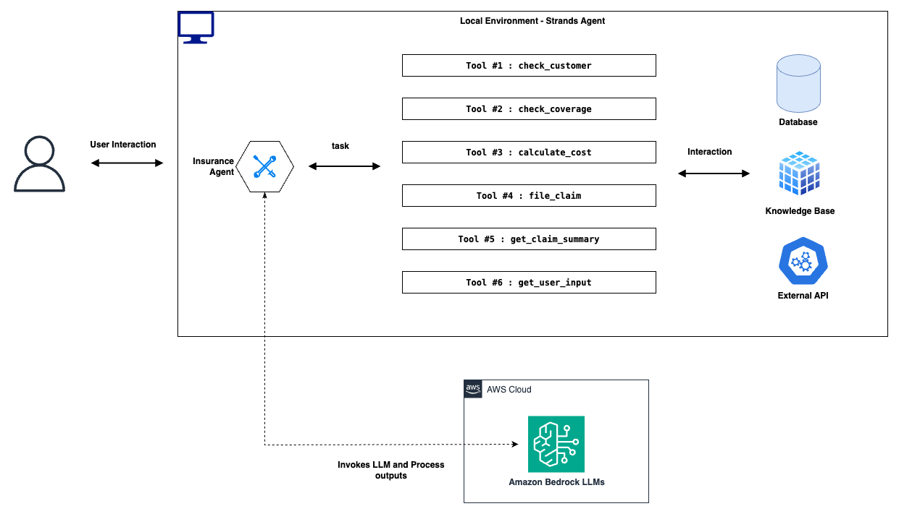

# ğŸ›¡ï¸ STRANDS Agent - Insurance Claim Demo

Today we will see a demo of Strands Agents which is a simple yet powerful SDK that takes a model-driven approach to building and running AI agents. From simple conversational assistants to complex autonomous workflows, from local development to production deployment, Strands Agents scales with your needs. You can learn more about Strands from [here](https://strandsagents.com/latest/)


This demo is a a simple command-line demonstration of multi-tool AI agent consolidation using the **Strands agents** framework. Shows how an AI agent can use multiple specialized tools to handle complex insurance claims in a single, consolidated response.

> Note : There is a UI version of this demo available, please see below for instructions to run it. 

## Prerequisite

1. Python 3.13.3 or higher
2. aws-cli/2.26.7 or higher
3. If running on local aws credentials and if cloud then required IAM role 
4. boto3 1.38.18 or higher
5. botocore 1.38.18 or higher

## Architecture

## 

## 🯠What This Demo Shows

### **Multi-Tool Consolidation**
- Agent uses **6 specialized tools** but gives **ONE consolidated response**
- Tools work together seamlessly: customer lookup → coverage check → cost calculation → claim filing
- Real business logic with actual decision-making workflows

### **Interactive Agent Behavior**
- Agent asks follow-up questions when information is missing
- Handles both complete requests and partial information gracefully
- Natural conversation flow with multi-turn interactions

## 🚀 Quick Start

> **Note:** This demo uses in-memory data structures for simplicity. In production environments, integrate with enterprise-grade services such as Amazon DynamoDB for customer data, Amazon RDS for transactional claims, and Amazon Bedrock Knowledge Bases for policy documentation. Strands agents are built to be production-ready and can be deployed locally for development, behind APIs using AWS Lambda/Fargate/EC2 with API Gateway for scalable applications, with tool isolation for enhanced security, or using a return-of-control model where clients manage tool execution while agents focus on reasoning. Implement proper rate limiting, authentication (AWS Cognito), authorization (IAM), and encryption (KMS) for production deployments. This demonstration represents the foundational patterns that scale seamlessly to enterprise infrastructure with full API management and flexible deployment capabilities.

### **Defining agent underlying LLM model**

You can also define our agent underlying model. Strands Agents natively integrate with Amazon Bedrock models, and provides the ability to configure how the model is called. Below, you can see a simple initialization of a BedrockModel provider, with some of the optional configurations commented out. You can learn more about configuration options, and default values, at Strands Agents Bedrock Model Provider documentation. For this demo will use the default underlying model.

```
model = BedrockModel(
    model_id="us.anthropic.claude-3-7-sonnet-20250219-v1:0",
    # region_name="us-east-1",
    # boto_client_config=Config(
    #    read_timeout=900,
    #    connect_timeout=900,
    #    retries=dict(max_attempts=3, mode="adaptive"),
    # ),
    # temperature=0.9,
    # max_tokens=2048,
)

agent = Agent(
    model=model,
    system_prompt=system_prompt,
    tools=[
        <<list of toolss>>
    ],
)
```

### **Install Dependencies**
```bash
pip install strands-agents
```

### **Run the Demo**
```bash
python insurance_claim_demo.py
```

## 📊 Test Data

### **Available Policies**
- **DEV-001**: John Smith, iPhone 15, Complete Coverage
- **DEV-002**: Sarah Johnson, Samsung S24, Basic Coverage  
- **DEV-003**: Mike Brown, iPad Pro, Theft Only Coverage

### **Supported Claim Types**
- `damage`, `water_damage`, `theft`, `lost`, `accidental_damage`

### **Coverage Rules**
- **Complete**: All claim types covered
- **Basic**: Damage and accidents only
- **Theft Only**: Theft and loss only

## 🮠Demo Scenarios

### **1. Complete Workflow**
```
Customer: "My device was damaged, what's covered and how much?"
Agent Response: "Your claim has been approved! Deductible: $199, Timeline: 2-3 days, Claim ID: CLM-001"
```

### **2. Interactive Mode**
```
Customer: "I need to file an insurance claim."
Agent: "I'd be happy to help! What's your insurance policy number?"
```

### **3. Multi-Option Analysis**
```
Customer: "I have multiple types of damage, what's my best option?"
Agent: Analyzes coverage, compares costs, recommends optimal approach
```

## 🯠Sample run
```
📱 Insurance Claim Demo
========================================
Customers: DEV-001 (John/iPhone), DEV-002 (Sarah/Samsung), DEV-003 (Mike/iPad)

🯠Choose scenario:
1. 📱 Cracked Screen + Coverage Check + File Claim
2. 💧 Water Damage + Cost + Timeline + Process
3. 🚨 Theft + Coverage Validation + Quick Claim
4. ⌠Multiple Issues + Coverage + Best Option
5. 🤔 Missing Details - Agent Asks for Policy & Damage Info
6. 🆕 No Details Given - Agent Asks Questions
7. 📊 New Claim + Update Summary + Status
8. Exit
========================================

Choice (1-6): 1

🔄 Scenario 1 - Multi-tool consolidation...
📱 Customer: 'My iPhone screen cracked, what's covered and how much?'
🔠Query to Agent: Policy DEV-001, cracked iPhone screen. Check coverage, cost, timeline, and file claim if covered.
I'll help you with your cracked iPhone screen claim. Let me check your policy information first.
Tool #1: check_customer
🔠DATABASE LOG: Searching customers_db for policy 'DEV-001'
📊 AVAILABLE POLICIES: ['DEV-001', 'DEV-002', 'DEV-003']
✅ CUSTOMER FOUND: {'name': 'John Smith', 'device': 'iPhone 15', 'coverage': 'complete'}
Thank you, Mr. Smith. I've verified your policy DEV-001 for your iPhone 15 with "complete" coverage. Now, let me check if cracked screens are covered under your plan.
Tool #2: check_coverage
🔠KNOWLEDGE BASE LOG: Checking coverage for incident 'cracked_screen' under 'complete' plan
📚 KB COVERAGE_TYPES: {'complete': ['cracked_screen', 'water_damage', 'theft', 'lost'], 'basic': ['cracked_screen', 'accidental_damage'], 'theft_only': ['theft', 'lost']}
📋 COVERAGE RESULT: 'cracked_screen' ✅ COVERED under 'complete'
📋 COVERED INCIDENTS FOR complete: ['cracked_screen', 'water_damage', 'theft', 'lost']
Good news! Your cracked screen is covered under your complete protection plan. Now, let me calculate the cost and repair timeline for you.
Tool #3: calculate_cost
🔠KNOWLEDGE BASE LOG: Looking up costs for device type 'iPhone' and incident 'cracked_screen'
💰 KB DEDUCTIBLES: {'iPhone': 199, 'Samsung': 149, 'iPad': 99}
â° KB REPAIR_TIMES: {'cracked_screen': '2-3 days', 'water_damage': 'replace immediately', 'theft': '24 hours after police report', 'lost': '24 hours'}
💵 COST CALCULATION: iPhone → $199 deductible
â±ï¸ TIME CALCULATION: cracked_screen → 2-3 days
Here's what you need to know:
- Your iPhone 15 screen repair has a $199 deductible
- Estimated repair timeline is 2-3 days

Would you like to proceed with filing the claim?
Tool #4: file_claim
🔠DATABASE LOG: Filing claim for policy 'DEV-001' with incident 'cracked_screen'
📊 CURRENT CLAIMS COUNT: 0
🆔 GENERATING CLAIM ID: CLM-001
👤 CUSTOMER FROM DB: {'name': 'John Smith', 'device': 'iPhone 15', 'coverage': 'complete'}
💰 DEDUCTIBLE FROM KB: $199
✅ CLAIM STORED: CLM-001 added to claims_db
📊 NEW CLAIMS COUNT: 1
Great! I've filed your claim successfully. Here's your claim summary:

- Claim ID: CLM-001
- Customer: John Smith
- Device: iPhone 15
- Issue: Cracked screen
- Deductible: $199
- Repair Timeline: 2-3 days

Your claim has been processed and is now ready to move forward. You can reference your claim ID (CLM-001) for any follow-up inquiries. Is there anything else you need help with regarding your device claim?
✅ Agent Response:
Great! I've filed your claim successfully. Here's your claim summary:

- Claim ID: CLM-001
- Customer: John Smith
- Device: iPhone 15
- Issue: Cracked screen
- Deductible: $199
- Repair Timeline: 2-3 days

Your claim has been processed and is now ready to move forward. You can reference your claim ID (CLM-001) for any follow-up inquiries. Is there anything else you need help with regarding your device claim?


ğŸ¯ğŸ¯ğŸ¯ğŸ¯ğŸ¯ğŸ¯ğŸ¯ğŸ¯ğŸ¯ğŸ¯ğŸ¯ğŸ¯ğŸ¯ğŸ¯ğŸ¯
Notice: AI used multiple tools but gave ONE consolidated answer
ğŸ¯ğŸ¯ğŸ¯ğŸ¯ğŸ¯ğŸ¯ğŸ¯ğŸ¯ğŸ¯ğŸ¯ğŸ¯ğŸ¯ğŸ¯ğŸ¯ğŸ¯

Press Enter for menu...

```
## 🯠Sample run with information collection

```
📱 Insurance Claim Demo
========================================
Customers: DEV-001 (John/iPhone), DEV-002 (Sarah/Samsung), DEV-003 (Mike/iPad)

🯠Choose scenario:
1. 📱 Cracked Screen + Coverage Check + File Claim
2. 💧 Water Damage + Cost + Timeline + Process
3. 🚨 Theft + Coverage Validation + Quick Claim
4. ⌠Multiple Issues + Coverage + Best Option
5. 🤔 Missing Details - Agent Asks for Policy & Damage Info
6. 🆕 No Details Given - Agent Asks Questions
7. 📊 New Claim + Update Summary + Status
8. Exit
========================================

Choice (1-6): 5

🔄 Scenario 5 - Multi-tool consolidation...
📊 Customer: 'My phone broke. Can you help me file a claim?'
🔠Query to Agent: My phone broke. Can you help me file a claim?
I'd be happy to help you file a claim for your broken phone. I'll need some additional information from you to get started.
Tool #5: get_user_input
🔠DATABASE LOG: Prompting user for input...
Could you please provide your device protection policy number? It should be in the format DEV-XXX.: DEV-002
📠INPUT RECEIVED: 'DEV-002'
Thank you for providing your policy number. Let me check your customer information.
Tool #6: check_customer
🔠DATABASE LOG: Searching customers_db for policy 'DEV-002'
📊 AVAILABLE POLICIES: ['DEV-001', 'DEV-002', 'DEV-003']
✅ CUSTOMER FOUND: {'name': 'Sarah Johnson', 'device': 'Samsung S24', 'coverage': 'basic'}
Thank you, Ms. Johnson. I've found your policy for your Samsung S24 with basic coverage. To better assist you with filing a claim, I need to understand what happened to your phone.
Tool #7: get_user_input
🔠DATABASE LOG: Prompting user for input...
Could you please describe what happened to your phone? For example: did it have water damage, cracked screen, or something else?: my phone dropped and screen is not working after that
📠INPUT RECEIVED: 'my phone dropped and screen is not working after that'
Thank you for that information. It sounds like you're experiencing a screen issue after dropping your phone. Let me check if this is covered under your basic protection plan.
Tool #8: check_coverage
🔠KNOWLEDGE BASE LOG: Checking coverage for incident 'cracked_screen' under 'basic' plan
📚 KB COVERAGE_TYPES: {'complete': ['cracked_screen', 'water_damage', 'theft', 'lost'], 'basic': ['cracked_screen', 'accidental_damage'], 'theft_only': ['theft', 'lost']}
📋 COVERAGE RESULT: 'cracked_screen' ✅ COVERED under 'basic'
📋 COVERED INCIDENTS FOR basic: ['cracked_screen', 'accidental_damage']
Good news! Screen damage is covered under your basic protection plan. Now, let me calculate the cost and timeline for repairing your Samsung S24.
Tool #9: calculate_cost
🔠KNOWLEDGE BASE LOG: Looking up costs for device type 'Samsung' and incident 'cracked_screen'
💰 KB DEDUCTIBLES: {'iPhone': 199, 'Samsung': 149, 'iPad': 99}
â° KB REPAIR_TIMES: {'cracked_screen': '2-3 days', 'water_damage': 'replace immediately', 'theft': '24 hours after police report', 'lost': '24 hours'}
💵 COST CALCULATION: Samsung → $149 deductible
â±ï¸ TIME CALCULATION: cracked_screen → 2-3 days
Here's what you can expect for your Samsung S24 repair:
- A deductible of $149
- Estimated repair timeline: 2-3 days

Would you like me to file the claim for you now?
Tool #10: get_user_input
🔠DATABASE LOG: Prompting user for input...
Should I proceed with filing the claim for your Samsung S24 with screen damage? (Yes/No): yes
📠INPUT RECEIVED: 'yes'
Great! I'll file the claim for your Samsung S24 right away.
Tool #11: file_claim
🔠DATABASE LOG: Filing claim for policy 'DEV-002' with incident 'cracked_screen'
📊 CURRENT CLAIMS COUNT: 1
🆔 GENERATING CLAIM ID: CLM-002
👤 CUSTOMER FROM DB: {'name': 'Sarah Johnson', 'device': 'Samsung S24', 'coverage': 'basic'}
💰 DEDUCTIBLE FROM KB: $149
✅ CLAIM STORED: CLM-002 added to claims_db
📊 NEW CLAIMS COUNT: 2
Your claim has been successfully filed! Here's your claim summary:

- Claim ID: CLM-002
- Name: Sarah Johnson
- Device: Samsung S24
- Issue: Screen damage from dropping phone
- Deductible: $149
- Estimated repair timeline: 2-3 days

You can reference your claim ID (CLM-002) for any future inquiries about your repair status. Is there anything else you need help with regarding your claim?
✅ Agent Response:
Your claim has been successfully filed! Here's your claim summary:

- Claim ID: CLM-002
- Name: Sarah Johnson
- Device: Samsung S24
- Issue: Screen damage from dropping phone
- Deductible: $149
- Estimated repair timeline: 2-3 days

You can reference your claim ID (CLM-002) for any future inquiries about your repair status. Is there anything else you need help with regarding your claim?


ğŸ¯ğŸ¯ğŸ¯ğŸ¯ğŸ¯ğŸ¯ğŸ¯ğŸ¯ğŸ¯ğŸ¯ğŸ¯ğŸ¯ğŸ¯ğŸ¯ğŸ¯
Notice: AI used multiple tools but gave ONE consolidated answer
ğŸ¯ğŸ¯ğŸ¯ğŸ¯ğŸ¯ğŸ¯ğŸ¯ğŸ¯ğŸ¯ğŸ¯ğŸ¯ğŸ¯ğŸ¯ğŸ¯ğŸ¯

Press Enter for menu...

```

## 🔠Behind the Scenes

### **6 Specialized Tools**
1. **`check_customer`** - Policy validation and lookup
2. **`check_coverage`** - Incident coverage verification  
3. **`calculate_cost`** - Deductible and timeline calculation
4. **`file_claim`** - Claim creation and approval
5. **`get_claim_summary`** - Claims reporting
6. **`get_user_input`** - Interactive information gathering


## 📋 Menu Options

```
1. ğŸ›¡ï¸ Damage Claim + Coverage Check + File Claim
2. 💧 Water Damage + Cost + Timeline + Process
3. 🚨 Theft + Coverage Validation + Quick Claim  
4. ⌠Multiple Issues + Coverage + Best Option
5. 🤔 Missing Details - Agent Asks for Policy & Claim Info
6. 🆕 No Details Given - Agent Asks Questions
7. 📊 New Claim + Update Summary + Status
8. Exit
```

### **Run the UI Demo**
```bash

pip install --upgrade gradio


python gradio_ui_demo.py
```

## 💡 Key Learning Points

- **Multi-tool agent patterns** for complex workflows
- **Tool consolidation techniques** for better user experience
- **Interactive agent design** with follow-up handling
- **Real business logic implementation** in AI systems

---

**Perfect for learning how to build intelligent, multi-tool AI agents that handle real-world insurance processes!**

*Built with [Strands Agents](https://strandsagents.com/latest/) - The multi-tool agent framework*